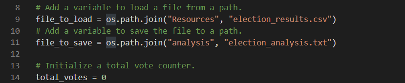

# Election_Analysis

# Overview

## Purpose
A election audit needs to be completed for the Colorado Board of Elections. A recent completed local comgressional election will need to be analyzed for the following information:

- Total number of votes cast
- A full  list of candidates who received votes, and percentage of the total vote
- Total number of votes each candidate received
- The winner of the election based on popular vote
- Percentage of votes each candidate won

# Resources
- Data source: election_results.csv
- Software: Python 3.7.6, VS Code Studio

# Election Audit Results
- The following image shows the complete list of lines of code with the results generated from the script. 

- The total votes casted in the congressional election is 369,711.
- Denver county has the largest number of cotes cast both in tota land percentage of total votes.
- Diana DeGette won the election with 272,892 votes.

# Election Audit Summary
- The written script could be reused with any modern elections without much modification needed. However, the CSV file must be read correctly to perform the necessary script for the analyzation, and the "election_analysis.txt" must be printed in the "Analysis" directory. To do so, the code has been written as the image below:

