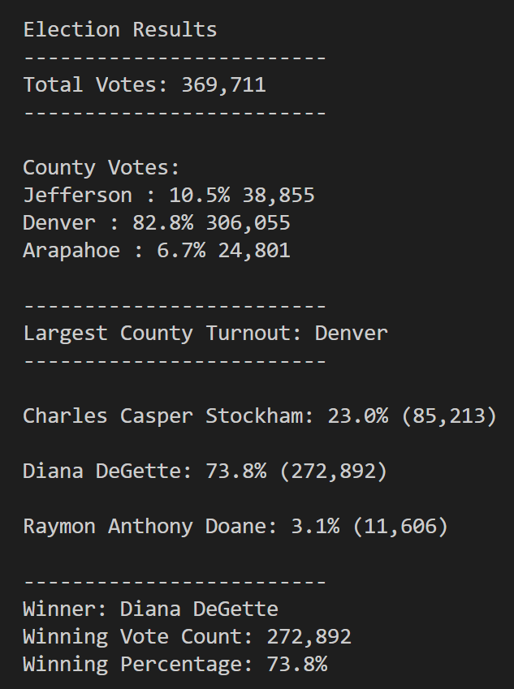

# Election_Analysis

# Overview

## Purpose
A election audit needs to be completed for the Colorado Board of Elections. A recent completed local comgressional election will need to be analyzed for the following information:

- Total number of votes cast
- A full  list of candidates who received votes, and percentage of the total vote
- Total number of votes each candidate received
- The winner of the election based on popular vote
- Percentage of votes each candidate won

# Resources
- Data source: election_results.csv
- Software: Python 3.7.6, VS Code Studio

# Election Audit Results
- The following image shows the complete list of lines of code with the results generated from the script. 

